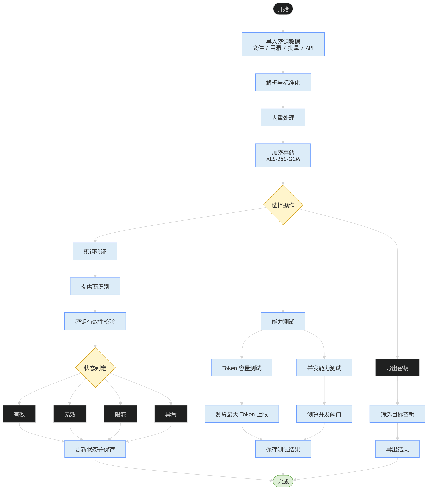

[](https://pypi.org/project/api-key-manager/)

[English](README_EN.md) | 中文

# API Key Manager

批量管理 45+ AI 服务商 API 密钥的 Python 工具，支持 CLI、Web 和桌面三种界面。

## 功能特性

- **批量导入** - 从 JSON 文件导入 API 密钥，自动去重
- **密钥验证** - 并发验证密钥有效性，支持 45+ AI 服务商
- **能力测试** - 测试 Token 上限和并发能力
- **模型筛选** - 按类型筛选模型（推理/视觉/联网/免费/嵌入/重排/工具）
- **智能检测** - 前缀匹配 + 模式匹配 + 错误签名匹配，三级提供商自动识别
- **自动发现** - 新增服务商只需创建 Python 文件，自动注册
- **可扩展架构** - 支持 YAML 配置自定义服务商，Web API 管理
- **Web 界面** - 赛博朋克风格的管理界面
- **代理支持** - 支持 HTTP/SOCKS 代理
- **加密存储** - AES-256-GCM 加密存储 API 密钥，随机盐值
- **安全防护** - 路径遍历防护、SSRF 防护、时序安全认证
- **API 文档** - Swagger UI 和 Redoc 自动文档
- **国际化** - 支持中英文错误信息
- **SDK 支持** - Python 和 TypeScript 客户端库
- **桌面应用** - 单 exe 便携安装，React 前端 + pywebview 桌面窗口
- **Webhook 通知** - 事件驱动的 Webhook 通知系统

## 快速开始

### 桌面应用（v5.0.3）

从 [Releases](https://github.com/Townrain/API-Key-Manager/releases) 下载 `KeyHub-Setup.exe`，选择任意目录安装即可。首次启动自动生成配置文件，所有数据保持在安装目录内。

### CLI / Web

```bash
pip install api-key-manager
python web.py
```

详细文档见下方。

## 系统架构




## 支持的 AI 服务商

### 国际

| 服务商 | 前缀 |
|--------|------|
| OpenAI | `sk-proj-` |
| Anthropic | `sk-ant-api03-` |
| Google Gemini | `AIza` |
| DeepSeek | `sk-` |
| Groq | `gsk_` |
| Mistral | `sk-` |
| Cohere | `sk-` |
| Perplexity | `pplx-` |
| Together AI | `sk-` |
| Replicate | `r8_` |
| Hugging Face | `hf_` |
| Fireworks | `fw_` |
| OpenRouter | `sk-or-v1-` |
| Grok (xAI) | `xai-` |
| Cerebras | `sk-` |
| NVIDIA | `sk-` |
| Hyperbolic | `sk-` |
| Poe | `sk-` |

### 中国

| 服务商 | 前缀 | 显示名 |
|--------|------|--------|
| 阿里百炼 | `sk-ws-` / `sk-` |
| 阿里百炼编程 | `sk-sp-` |
| ModelScope | `ms-` | 魔搭 |
| Zhipu GLM | `sk-` | 智谱 |
| Kimi | `sk-` | 月之暗面 |
| MiniMax | `sk-` | MiniMax |
| SiliconFlow | `sk-` | 硅基流动 |
| Baichuan | `sk-` | 百川 |
| Yi | `sk-` | 零一万物 |
| StepFun | `sk-` | 阶跃星辰 |
| Doubao | `sk-` | 豆包 |
| Infini | `sk-` | 无问芯穹 |
| MiMo | `sk-` | 小米 |
| Tencent Hunyuan | `sk-` | 腾讯混元 |
| CSTCloud | `sk-` | 中算云 |

### 新增服务商

| 服务商 | 说明 |
|--------|------|
| LongCat | 新增 |
| AI302 | 新增 |
| PPIO | 新增 |
| DMXAPI | 新增 |
| OCoolAI | 新增 |
| ZAI | 新增 |
| MiMo Plan | 计划版 |
| MiniMax Plan | 计划版 |
| DashScope Coding | 编程版 |
| Zhipu Coding | 编程版 |
| Kimi Coding | 编程版 |
| Infini Coding | 编程版 |

## 添加自定义服务商

### 方式一：Python 文件（推荐）

创建 `key_manager/providers/my_llm.py`：

```python
from .base import ProviderBase


class MyLlmProvider(ProviderBase):
    name = "my-llm"
    base_url = "https://api.my-llm.com/v1"
    check_endpoint = "/models"
    check_model = "my-model"
    display_name = "My LLM"
    key_prefixes = ["myllm-"]
    error_signatures = ["my-llm", "invalid api key"]
    website_url = "https://my-llm.com"
    docs_url = "https://docs.my-llm.com"

    def build_headers(self, key: str) -> dict:
        return {"Authorization": f"Bearer {key}"}
```

重启服务即可自动发现。

### 方式二：YAML 配置

在 `config.yaml` 中添加：

```yaml
providers:
  custom:
    - name: "my-llm"
      base_url: "https://api.my-llm.com/v1"
      check_endpoint: "/models"
      check_model: "my-model"
      display_name: "My LLM"
      key_prefixes: ["myllm-"]
      auth_type: bearer
```

### 方式三：Web API

```bash
# 添加服务商
curl -X POST http://localhost:18001/api/providers \
  -H "Content-Type: application/json" \
  -d '{"name":"my-llm","base_url":"https://api.my-llm.com/v1","check_endpoint":"/models"}'

# 列出所有服务商
curl http://localhost:18001/api/providers

# 删除服务商
curl -X DELETE http://localhost:18001/api/providers/my-llm
```

## 快速开始

### 安装

```bash
# 从 PyPI 安装（推荐）
pip install api-key-manager
```

```bash
# 或从源码安装（开发模式）
git clone https://github.com/Townrain/API-Key-Manager.git
cd key

# 安装依赖
pip install -r requirements.txt

# 安装开发依赖（含测试工具）
pip install -e ".[dev]"
```

### CLI 使用

```bash
# 导入密钥
python main.py import --file data/input/example.json
python main.py import --dir ./data/input

# 验证密钥
python main.py check
python main.py check --provider openai
python main.py check --key sk-xxx

# 测试密钥
python main.py test
python main.py test --skip-token
python main.py test --skip-concurrency

# 列出密钥
python main.py list --provider anthropic --status valid
python main.py list --status invalid

# 生成报告
python main.py report --days 7
```

### Web 界面

```bash
# 启动 Web 服务器
python web.py

# 访问以下地址：
# 主界面：http://localhost:18001
# API 文档：http://localhost:18001/docs
# Redoc：http://localhost:18001/redoc
```

## 安全特性

### 加密存储

API 密钥支持 AES-256-GCM 加密存储（默认开启），每次加密使用随机盐值：

```bash
# 设置加密密钥（环境变量）
set KEY_MANAGER_SECRET=your-secret-key

# 启动服务
python web.py
```

加密后的 `keys.json` 格式：
```json
{
  "encrypted": true,
  "salt": "base64-encoded-random-salt",
  "nonce": "base64-encoded-nonce",
  "data": "base64-encoded-ciphertext"
}
```

#### 可选加密开关

从 v4.2.0 起，支持通过配置关闭加密，以明文存储密钥（便于本地开发）：

```yaml
# config.yaml
storage:
  keys_file: "./data/keys.json"
  encrypted: false  # 明文存储（本地开发推荐）
  # encrypted: true  # 加密存储（生产环境推荐，默认值）
```

**说明：**
- `encrypted: true`（默认）— 使用 AES-256-GCM 加密，需设置 `KEY_MANAGER_SECRET`
- `encrypted: false` — 明文 JSON 存储，无需配置密钥，便于调试和迁移
- `load()` 自动检测文件格式，无论配置如何均可读取已有文件

### 安全防护

- **路径遍历防护** - 导入端点验证路径在允许目录内
- **SSRF 防护** - `custom_base_url` 验证域名白名单，阻止私有 IP，已接入 `check/single` 和 `balance` 端点
- **时序安全认证** - 使用 `hmac.compare_digest()` 防止时序攻击
- **认证警告** - 未配置 API Key 时启动警告
- **密钥掩码** - API 响应中只返回 `key_masked`，不暴露完整密钥
- **Webhook 安全** - Webhook 端点使用正确的 API 方法，防止运行时错误

### API 认证

```bash
# 设置 API Key（环境变量）
set KEY_MANAGER_API_KEY=your-api-key

# 或在 config.yaml 中配置
# auth:
#   api_key: "your-api-key"
```

## 提供商智能检测

### 检测策略

系统采用**全并发探测**策略，自动识别 45+ 个 AI 服务商的 API 密钥。

### 检测流程（重要！）

```
1. 前缀匹配 - 检查唯一前缀（如 sk-proj- → OpenAI，AIza → Google）
2. 格式匹配 - 检查特殊格式（如智谱的 {id}.{secret} 格式）
3. 全并发探测 - 同时向所有服务商发送请求
4. 签名匹配 - 如果无200响应，通过错误响应体签名识别服务商
```

### ⚠️ 关键概念：/v1/models vs /chat/completions

**这两个端点的作用完全不同，不能混用！**

| 端点 | 作用 | 返回200的含义 |
|------|------|--------------|
| `/v1/models` | 获取模型列表 | 只表示可以获取模型列表，**不能**判断密钥是否有效 |
| `/chat/completions` | 调用模型 | 表示密钥对该提供商有效，**这才是判断提供商的依据** |

**常见错误：**
- ❌ 用 `/v1/models` 返回200来判断提供商 → 错误！
- ✅ 用 `/chat/completions` 返回200来判断提供商 → 正确！

### 检测流程详解

#### Step 1: 前缀匹配

检查密钥是否匹配唯一前缀：

```python
# 唯一前缀 → 直接返回
"sk-proj-" → OpenAI
"sk-ant-api03-" → Anthropic
"AIza" → Google
"ms-" → ModelScope

# 共享前缀 → 需要进一步探测
"sk-" → 20+ 提供商（DeepSeek, OpenAI, 等）
```

#### Step 2: 格式匹配

检查密钥是否匹配特殊格式：

```python
# 智谱/Z.AI 格式：{id}.{secret}
50bcde33b8774aa8a2cc1bd6d39444ae.ifriyNWRLStzpLEs
→ 返回 ["zhipu", "zai"]
```

#### Step 3: 全并发探测（核心逻辑）

**重要：这一步用 `/chat/completions` 验证，不是 `/v1/models`！**

```python
async def detect_provider(client, key):
    # Step 3.1: 获取所有提供商的模型列表（/v1/models）
    # 这一步只是为了获取模型列表，不能判断提供商
    models = {}
    for name, provider in PROVIDERS.items():
        resp = await client.get(f"{provider.base_url}/v1/models")
        if resp.status_code == 200:
            models[name] = extract_models(resp.json())
    
    # Step 3.2: 并发测试所有（提供商，模型）对的 /chat/completions
    # 这一步才是判断提供商的依据！
    tasks = []
    for name, model_list in models.items():
        for model in model_list:
            tasks.append(try_chat_completion(name, model))
    
    # 第一个返回200的提供商胜出
    for coro in asyncio.as_completed(tasks):
        name, valid, status_code = await coro
        if valid:  # /chat/completions 返回200
            return name
```

#### Step 4: 签名匹配

如果所有 `/chat/completions` 都失败，通过错误响应体识别提供商：

```python
# 错误签名匹配
UNIQUE_SIGNATURES = {
    "dashscope": ["model-studio", "modelstudio", "apikey-error"],
    "anthropic": ["request not allowed", "anthropic", "x-api-key"],
    "openai": ["platform.openai.com"],
    # ... 更多签名
}

# 匹配阈值：至少2个签名匹配（200分）才返回结果
if best_score >= 200:
    return best_name
```

### 免费模型的重要性

**某些提供商（如 OpenCode Zen）提供免费模型，这些模型对检测非常重要！**

```python
# OpenCode Zen 的模型列表：
# - claude-fable-5 (付费)
# - deepseek-v4-flash-free (免费) ✅
# - mimo-v2.5-free (免费) ✅
# - ...

# 如果密钥只对免费模型有效：
# - /chat/completions + claude-fable-5 → 401 (付费模型，无权限)
# - /chat/completions + deepseek-v4-flash-free → 200 (免费模型，有权限) ✅
```

**检测逻辑会并发测试所有模型，包括免费模型。只要有一个模型返回200，提供商就会被正确识别。**

### 检测优先级

| 优先级 | 方法 | 端点 | 说明 |
|--------|------|------|------|
| 1 | 前缀匹配 | - | 唯一前缀，如 `sk-proj-` → OpenAI |
| 2 | 格式匹配 | - | 特殊格式，如 `{id}.{secret}` → 智谱 |
| 3 | 全并发探测 | `/chat/completions` | 第一个返回200的提供商胜出 |
| 4 | 签名匹配 | - | 通过错误响应体识别，需至少2个签名匹配 |

### 常见问题

#### Q: 为什么我的密钥被错误识别为其他提供商？

**A: 可能是因为：**
1. 密钥使用共享前缀（如 `sk-`），需要通过 `/chat/completions` 验证
2. 密钥只对免费模型有效，但检测逻辑没有测试免费模型
3. 提供商的 `/v1/models` 返回200，但 `/chat/completions` 返回401

#### Q: 为什么 `/v1/models` 返回200，但检测失败？

**A: 因为 `/v1/models` 返回200不能判断提供商！**
- `/v1/models` 只表示可以获取模型列表
- `/chat/completions` 返回200才能判断提供商

#### Q: 如何确保检测正确？

**A: 确保以下几点：**
1. 密钥对至少一个模型有调用权限（包括免费模型）
2. 提供商的 `/chat/completions` 端点正常工作
3. 密钥没有过期或被撤销

### 检测流程图

```
输入: API Key
     │
     ▼
┌─────────────────────────────────────────────────────────────┐
│ Step 1: 前缀匹配                                            │
│   - 唯一前缀 → 直接返回（如 sk-proj- → OpenAI）              │
│   - 共享前缀 → 继续下一步                                    │
└─────────────────────────────────────────────────────────────┘
     │
     ▼
┌─────────────────────────────────────────────────────────────┐
│ Step 2: 格式匹配                                            │
│   - 智谱格式 {id}.{secret} → 返回 ["zhipu", "zai"]          │
└─────────────────────────────────────────────────────────────┘
     │
     ▼
┌─────────────────────────────────────────────────────────────┐
│ Step 3: 全并发探测（用 /chat/completions 验证）               │
│                                                             │
│   3.1 获取所有提供商的模型列表（/v1/models）                  │
│       - 这一步只是为了获取模型，不能判断提供商                 │
│                                                             │
│   3.2 并发测试所有（提供商，模型）对的 /chat/completions       │
│       - 第一个返回200的提供商胜出                             │
│       - 包括免费模型和付费模型                                │
└─────────────────────────────────────────────────────────────┘
     │
     ▼
┌─────────────────────────────────────────────────────────────┐
│ Step 4: 签名匹配（如果 /chat/completions 都失败）             │
│   - 通过错误响应体中的关键词识别提供商                        │
│   - 需要至少2个签名匹配（200分）才返回结果                    │
└─────────────────────────────────────────────────────────────┘
```

### 代码实现

检测逻辑在 `key_manager/detector.py` 中实现：

```python
async def detect_provider(client, key: str, suspected_provider: str = None) -> str:
    """Detect provider by concurrently probing ALL providers with multiple models.
    
    Strategy:
    1. If suspected_provider given, try it first
    2. If key matches unique pattern, try that provider
    3. Otherwise, concurrently probe ALL providers with their top 5 models
    4. First provider returning 200 wins
    """
    # Step 1: If suspected provider, try it first
    if suspected_provider:
        provider_name = suspected_provider.lower()
        if provider_name in PROVIDERS:
            return provider_name
    
    # Step 2: Try format matching (e.g., Zhipu's {id}.{secret})
    format_candidates = detect_by_format(key)
    if format_candidates:
        for name in format_candidates:
            if name in PROVIDERS:
                return name
    
    # Step 3: Try prefix matching
    prefix_candidates = detect_by_prefix(key)
    if prefix_candidates:
        if len(prefix_candidates) == 1:
            return prefix_candidates[0]
        # If multiple candidates, continue to Step 4
    
    # Step 4: Concurrently probe ALL providers
    # First, get models from all providers concurrently
    model_tasks = [get_provider_models(name, provider) for name, provider in PROVIDERS.items()]
    model_results = await asyncio.gather(*model_tasks)
    
    # Build tasks: (provider_name, model) pairs
    tasks = []
    for name, models, is_valid in model_results:
        if models:
            for model in models:
                tasks.append((name, model))
    
    # Concurrently check all (provider, model) pairs
    all_tasks = [try_model(name, model) for name, model in tasks]
    
    # First provider returning 200 wins
    for coro in asyncio.as_completed(all_tasks):
        name, valid, body, status_code = await coro
        if valid:
            return name
    
    # Step 5: Signature matching
    return match_by_signature(error_bodies)
```

## 错误信息简化

系统会自动将服务商返回的原始错误信息简化为用户友好的提示：

| 原始错误信息 | 简化后 |
|-------------|--------|
| `Access denied, please make sure your account is in good standing...` | 余额不足 |
| `Invalid API Key` | Key 无效 |
| `Authentication fails` | 认证失败 |
| `Token expired` | Key 已过期 |
| `Rate limit exceeded` | 请求过于频繁 |
| `Account suspended` | 账号被封禁 |
| `Access denied` | 无权限访问 |
| `Model does not exist` | 模型不存在 |

错误信息简化在 `base.py` 的 `simplify_error()` 函数中实现，支持：

- 基于状态码的简化（401 → Key 无效，402 → 余额不足，429 → 请求过于频繁）
- 基于关键词的模式匹配（authentication、expired、rate limit 等）
- 长错误信息截断（超过100字符时截断并添加省略号）

## 模型检测

### 模型列表来源

系统从 OpenCode [models.dev](https://models.dev) 同步模型数据，生成 `models_registry.py` 文件（中国区服务商保留 Cherry Studio 数据）：

```python
PROVIDER_MODELS = {
    "openai": ["gpt-4o", "gpt-4o-mini", "gpt-3.5-turbo", ...],
    "anthropic": ["claude-3-opus", "claude-3-sonnet", ...],
    "dashscope": ["qwen-turbo", "qwen-plus", "qwen-max", ...],
    "siliconflow": ["Qwen/Qwen2.5-7B-Instruct", ...],
    # ... 45+ 服务商
}
```

### 模型检测流程

当用户点击「检测可用模型」时：

1. 获取服务商的模型列表（优先使用 API 返回，回退到静态列表）
2. 并发检测每个模型的可用性（batch_size 动态调整）
3. 每个模型发送一个最小请求（`POST /chat/completions`，`max_tokens: 5`）
4. 返回200的模型标记为可用，其他标记为失败
5. 失败的模型会串行重试（最多2次）

```python
# 模型检测逻辑
async def check_model(http, model):
    resp = await client.post(
        f"{provider.get_base_url()}/chat/completions",
        json={"model": model, "messages": [...], "max_tokens": 5}
    )
    return model, 200 if resp.status_code == 200 else resp.status_code

# 动态并发控制
batch_size = 5  # 初始并发数
for i in range(0, len(models), batch_size):
    batch = models[i:i+batch_size]
    results = await asyncio.gather(*[check_model(http, m) for m in batch])
    
    # 全部成功 → 并发数 +1
    if all_success:
        batch_size += 1
    # 有失败 → 保持当前并发数
    
    # 失败模型串行重试
    for model in failed_models:
        _, code = await check_model(http, model)
        if code == 200:
            # 重试成功
```

### 模型能力检测

系统支持按类型筛选模型：

| 类型 | 说明 | 筛选方法 | 数据来源 |
|------|------|----------|----------|
| 视觉模型 | 支持图像输入 | `is_vision_model()` | models.dev |
| 工具模型 | 支持函数调用 | `is_tool_model()` | models.dev |
| 推理模型 | 支持思维链 | `is_reasoning_model()` | models.dev |

能力数据（vision / tooluse / reasoning）从 [models.dev](https://models.dev/api.json) 同步，基于显式布尔字段，存储在 `data/model_capabilities.json` 中。

### 模型能力说明

> **v4.4**: 能力检测从 Cherry Studio 正则迁移到 [OpenCode models.dev](https://models.dev) 显式字段。
> 仅保留三个可靠能力：**vision**（`modalities.input`）、**tooluse**（`tool_call`）、**reasoning**（`reasoning`）。
> 新增 `scripts/extract_from_opencode.py`，CI `.github/workflows/sync-opencode-models.yml` 每日自动同步。

## 项目结构
```
key/
├── key_manager/                    # 核心包
│   ├── __init__.py                 # 包导出
│   ├── cli.py                      # CLI 入口
│   ├── web/                        # Web 模块 (v4.0.0 重构)
│   │   ├── __init__.py             # 包导出
│   │   ├── _app.py                 # FastAPI 应用入口
│   │   ├── middleware.py           # 中间件和错误处理器
│   │   ├── progress.py             # ProgressTracker和SSE辅助
│   │   └── routes/                 # 路由模块
│   │       ├── keys.py             # 密钥管理路由
│   │       ├── check.py            # 验证路由
│   │       ├── test.py             # 测试路由
│   │       ├── balance.py          # 余额查询路由
│   │       ├── models.py           # 模型路由
│   │       ├── providers.py        # 提供商路由
│   │       ├── stats.py            # 统计路由
│   │       └── misc.py             # 杂项路由
│   ├── config.py                   # 配置加载
│   ├── storage.py                  # AES-256-GCM 加密存储
│   ├── errors.py                   # 结构化错误码
│   ├── api_models.py               # Pydantic 模型
│   ├── parser.py                   # JSON 导入 + 路径验证
│   ├── detector.py                 # 智能提供商检测
│   ├── validator.py                # 并发验证引擎
│   ├── checker.py                  # 重试包装器
│   ├── tester.py                   # 能力测试
│   ├── ssrf.py                     # SSRF 防护
│   ├── logger.py                   # 日志系统
│   ├── proxy.py                    # 代理检测
│   ├── webhook.py                  # Webhook 通知
│   ├── i18n.py                     # 国际化
│   ├── model_capabilities.py       # 模型能力检测
│   └── providers/                  # 45+ 提供商实现
│       ├── __init__.py             # 注册表
│       ├── base.py                 # ABC 接口
│       ├── openai.py               # OpenAI
│       ├── anthropic.py            # Anthropic
│       └── ...                     # 更多提供商
├── static/                         # 前端静态资源 (v4.0.0 重构)
│   ├── css/
│   │   ├── tokens.css              # CSS 变量
│   │   ├── base.css                # 基础样式
│   │   ├── components.css          # 组件入口 (@import)
│   │   ├── components/             # 独立组件样式
│   │   │   ├── button.css          # 按钮
│   │   │   ├── form.css            # 表单控件
│   │   │   ├── card.css            # 卡片、操作区
│   │   │   ├── table.css           # 表格、徽章、分页
│   │   │   ├── stat.css            # 统计卡片
│   │   │   ├── nav.css             # 导航标签
│   │   │   └── overlay.css         # 进度、Toast、日志
│   │   ├── modals.css              # 模态框样式
│   │   └── animations.css          # 动画
│   └── js/
│       ├── state.js                # 全局状态
│       ├── utils.js                # 工具函数
│       ├── api/                    # API 模块
│       │   ├── client.js           # 通用 fetch 逻辑
│       │   ├── index.js            # 重新导出
│       │   ├── stats.js            # 统计 API
│       │   ├── keys.js             # 密钥 API
│       │   ├── check.js            # 验证 API
│       │   ├── test.js             # 测试 API
│       │   ├── balance.js          # 余额 API
│       │   ├── models.js           # 模型 API
│       │   ├── providers.js        # 提供商 API
│       │   └── misc.js             # 杂项 API
│       ├── toast.js                # Toast 通知
│       ├── progress.js             # 进度覆盖层
│       ├── confirm.js              # 确认模态框
│       ├── keys-table.js           # 表格渲染
│       ├── providers.js            # 提供商网格
│       ├── batch.js                # 批量结果
│       ├── modals.js               # 模态框
│       ├── model-detect.js         # 模型检测
│       └── init.js                 # 入口点
├── templates/
│   └── index.html                  # Web UI 入口 (467行)
├── tests/                          # 测试套件
│   ├── conftest.py                 # 共享 fixtures 和帮助函数
│   ├── test_detector.py            # 提供商检测测试
│   ├── test_parser.py              # 解析器测试
│   ├── test_validator.py           # 验证器测试
│   ├── test_checker.py             # 检查器测试
│   ├── test_providers.py           # 提供商合约测试
│   ├── test_security.py            # 安全回归测试
│   ├── test_storage.py             # 加密存储测试
│   ├── test_errors.py              # 错误系统测试
│   ├── test_i18n.py                # 国际化测试
│   ├── test_e2e.py                 # 端到端测试
│   ├── test_webhook.py             # Webhook 测试
│   ├── test_bug_fixes.py           # Bug 修复回归测试
│   └── test_provider_refactoring.py # 提供商重构测试
├── sdk/                            # SDK
│   ├── python/                     # Python SDK
│   └── typescript/                 # TypeScript SDK
├── config.yaml                     # 配置文件
├── pyproject.toml                  # 项目配置
├── main.py                         # CLI 入口
└── web.py                          # Web 入口
```

## 配置说明

编辑 `config.yaml`：

```yaml
# 代理设置
proxy: "http://127.0.0.1:7890"  # 或 socks5://127.0.0.1:7890

# 验证设置
check:
  concurrency: 100              # 并发数
  timeout_seconds: 30           # 超时时间
  retry_failed: true            # 失败重试
  retry_count: 2                # 重试次数

# 测试设置
test:
  token_steps:
    - 1024
    - 4096
    - 16384
    - 65536
  concurrency_steps:
    - 1
    - 5
    - 10
    - 20

# 存储设置
storage:
  keys_file: "./data/keys.json"
  encrypted: true  # 设为 false 可关闭加密，以明文存储（便于本地开发）

# 认证设置
auth:
  api_key: "your-secret-api-key"  # API 认证

# 速率限制
rate_limit:
  requests_per_minute: 60
```

## API 端点

| 方法 | 端点 | 说明 |
|------|------|------|
| GET | `/api/keys` | 获取密钥列表 |
| GET | `/api/keys/export` | 导出有效密钥 |
| POST | `/api/import` | 导入密钥 |
| POST | `/api/import/upload` | 上传 JSON 文件导入 |
| POST | `/api/check/single` | 验证单个密钥 |
| POST | `/api/check/batch` | 批量验证 |
| POST | `/api/test/single` | 测试单个密钥 |
| POST | `/api/test/token` | 测试 Token 上限 |
| POST | `/api/test/concurrency` | 测试并发能力 |
| GET | `/api/models` | 获取模型列表 |
| POST | `/api/models/check` | 检测可用模型（SSE 流） |
| GET | `/api/providers` | 获取服务商列表 |
| GET | `/api/stats` | 获取统计信息 |
| GET | `/api/logs` | 获取日志 |
| POST | `/api/webhooks` | 创建 Webhook |
| GET | `/docs` | Swagger UI 文档 |
| GET | `/redoc` | Redoc 文档 |

## Webhook 使用

### 支持的事件类型

| 事件 | 说明 |
|------|------|
| `key.imported` | 密钥导入完成 |
| `key.checked` | 密钥验证完成 |
| `key.tested` | 密钥测试完成 |
| `key.deleted` | 密钥删除 |
| `batch.check.completed` | 批量验证完成 |
| `batch.test.completed` | 批量测试完成 |
| `error.occurred` | 发生错误 |

### 配置 Webhook

```yaml
webhooks:
  - url: "https://example.com/webhook"
    events:
      - "key.imported"
      - "key.checked"
    secret: "your-webhook-secret"  # HMAC-SHA256 签名
    active: true
    max_retries: 3
```

### 签名验证

```python
import hmac
import hashlib
import json

def verify_signature(payload, secret, signature):
    body = json.dumps(payload, separators=(",", ":"), sort_keys=True)
    expected = hmac.new(
        secret.encode("utf-8"),
        body.encode("utf-8"),
        hashlib.sha256,
    ).hexdigest()
    return signature == f"sha256={expected}"
```

## 测试

```bash
# 运行所有测试
python -m pytest tests/ -v

# 运行特定测试
python -m pytest tests/test_security.py -v
python -m pytest tests/test_detector.py -v

# 运行测试并查看覆盖率
python -m pytest tests/ --cov=key_manager --cov-report=term-missing
```

### 测试覆盖

| 模块 | 测试文件 | 测试数 |
|------|---------|--------|
| 检测逻辑（单元） | `test_detector_unit.py` | 31 |
| 检测逻辑（端点） | `test_provider_detection.py` | — |
| 测试路由 | `test_routes_test.py` | 48 |
| 提供商路由 | `test_routes_providers.py` | 32 |
| 杂项路由 | `test_routes_misc.py` | 26 |
| 模型路由 | `test_routes_models.py` | 34 |
| 验证路由 | `test_routes_check.py` | 23 |
| 提供商合约 | `test_providers.py` | 220 |
| 密钥解析 | `test_parser.py` | 24 |
| 安全回归 | `test_security.py` | 21 |
| 加密存储 | `test_storage.py` | 26 |
| 错误系统 | `test_errors.py` | 28 |
| 国际化 | `test_i18n.py` | 37 |
| Webhook | `test_webhook.py` | 35 |
| 端到端 | `test_e2e.py` | 18 |
| 代理检测 | `test_proxy.py` | 19 |
| 日志系统 | `test_logger.py` | 21 |
| 核心门面 | `test_core.py` | 22 |
| Bug 修复 | `test_bug_fixes.py` | 15 |
| 提供商重构 | `test_provider_refactoring.py` | 32 |

**总测试数**: 913 | **覆盖率**: 92.09%
## SDK 使用

### Python SDK

```bash
cd sdk/python
pip install -e .
```

```python
from key_manager_sdk import KeyManagerClient

client = KeyManagerClient(base_url="http://localhost:18001")

# 获取密钥列表
keys = client.keys()

# 验证单个密钥
result = client.check_single(key="sk-xxx", provider="openai")
```

### TypeScript SDK

```bash
cd sdk/typescript
npm install
```

```typescript
npm install @api-key-manager/sdk

const client = new KeyManagerClient({ baseUrl: 'http://localhost:18001' });

// 获取密钥列表
const keys = await client.keys();

// 验证单个密钥
const result = await client.checkSingle({ key: 'sk-xxx', provider: 'openai' });
```

## 依赖

- Python 3.10+
- httpx - 异步 HTTP 客户端
- FastAPI - Web 框架
- uvicorn - ASGI 服务器
- PyYAML - 配置解析
- Rich - 终端美化
- cryptography - 加密存储
- pydantic - 数据验证

## 已知问题和限制

### 1. 中转站服务商误识别

由于某些中转站服务商（如 Z.AI、DMXAPI、OCoolAI 等）使用与原厂相同的 API 端点和模型，当密钥无效时，错误响应可能包含原厂的签名关键词，导致误识别。

例如：一个硅基流动的密钥，如果被发送到阿里百炼的端点，阿里百炼会返回包含 "model-studio" 和 "apikey-error" 的错误响应，这可能导致系统误认为该密钥是阿里百炼的。

**解决方案**：系统要求至少2个签名匹配（200分）才返回识别结果，以减少误报。

### 2. 签名匹配的局限性

签名匹配依赖于服务商返回的错误响应体中的关键词。如果服务商更改了错误消息格式，签名可能失效。

**建议**：定期运行 `verify_signatures.py` 脚本验证签名的有效性。

### 3. 并发检测的超时问题

全并发探测时，某些服务商可能响应较慢（超过10秒超时）。这可能导致有效的服务商被跳过。

**解决方案**：系统会对失败的模型进行串行重试（最多2次）。

### 4. 智谱/Z.AI 密钥的双重检测

智谱和 Z.AI 使用相同的 GLM 模型和 API 格式，但使用不同的 Base URL：

- 智谱：`https://open.bigmodel.cn/api/paas/v4`
- Z.AI：`https://api.z.ai/api/paas/v4`

同一个密钥可能在两个平台都能工作，系统会返回第一个响应200的服务商。

### 5. 模型列表的时效性

模型列表从 [models.dev](https://models.dev) 同步，每日更新一次。新发布的模型可能需要等待同步后才能被检测到。

## 预期的设计决策（安全审查说明）

> **重要**：以下设计决策是**有意为之**，不是安全漏洞。安全审查工具可能会标记这些行为，但它们是本项目作为**本地API密钥管理工具**的合理设计。

### 1. 认证默认禁用

**行为**：当未配置 `api_key` 或 `KEY_MANAGER_API_KEY` 时，所有API端点无需认证即可访问。

**原因**：这是本地开发工具，首次运行时用户可能尚未配置认证。系统会自动从加密密钥派生API token，确保在有加密密钥的情况下仍能提供基本安全。

**配置方式**：
```bash
# 方式1: 环境变量
set KEY_MANAGER_API_KEY=your-api-key

# 方式2: config.yaml
auth:
  api_key: "your-api-key"
```

### 2. API Token注入到HTML

**行为**：`window.__API_TOKEN__` 被注入到 `templates/index.html` 的 `<head>` 中。

**原因**：前端JavaScript需要调用API，必须携带认证token。这是单页应用的标准做法，确保前端能自动携带token而无需用户手动配置。

**安全说明**：
- Token从加密密钥派生，不是明文密码
- 仅在本地访问时暴露（`localhost:18001`）
- 生产环境应配置反向代理和HTTPS

### 3. 完整密钥检索端点

**行为**：`POST /api/keys/get-full-key` 返回未掩码的完整API密钥。

**原因**：用户需要复制完整密钥用于其他应用。这是密钥管理工具的核心功能。

**安全措施**：
- 需要认证（Bearer token）
- 通过 `key_masked` 查询，不直接暴露密钥列表
- 记录审计日志

### 4. 速率限制存储无界增长

**行为**：`_RATE_LIMIT_STORE` 字典在内存中存储所有IP的请求记录，无最大条目限制。

**原因**：这是本地工具，通常只有少量客户端访问。DDoS攻击场景不现实（内部使用）。

**缓解措施**：
- 每60秒清理超过5分钟不活跃的IP
- 可通过 `rate_limit.requests_per_minute: 0` 禁用速率限制

### 5. 中间件执行顺序

**行为**：中间件顺序为 `rate_limit → auth → i18n`，未认证请求会消耗速率限制配额。

**原因**：这是内部工具，攻击者场景不现实。顺序调整对正常使用几乎无影响。

**说明**：即使是未认证请求，也应该被速率限制，防止意外的大量请求（如前端bug导致的循环请求）。

### 6. 文件不存在时返回空数据

**行为**：当 `keys.json` 文件不存在时，`_load_keys_data()` 返回 `{"keys": {}}` 而不是抛出异常。

**原因**：首次运行时，密钥文件尚未创建，这是有效状态。系统应优雅处理这种情况，而不是崩溃。

**实现**：在调用 `KeyStore.load()` 前检查文件是否存在：
```python
def _load_keys_data(config_override: dict | None = None) -> dict:
    cfg = config_override or config
    keys_path = Path(cfg["storage"]["keys_file"])
    if not keys_path.exists():
        return {"keys": {}}
    # ... 继原有逻辑
```

---

## 更新日志

详见 [CHANGELOG.md](CHANGELOG.md)


## 许可证

MIT License
